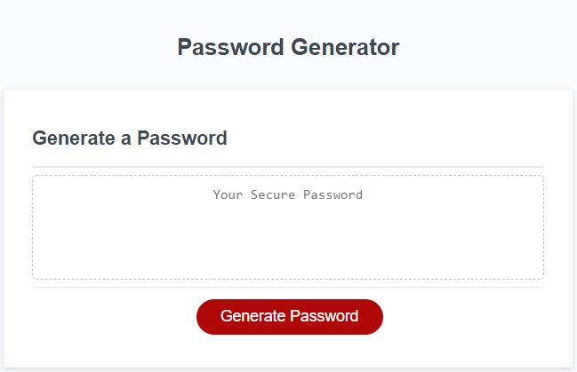
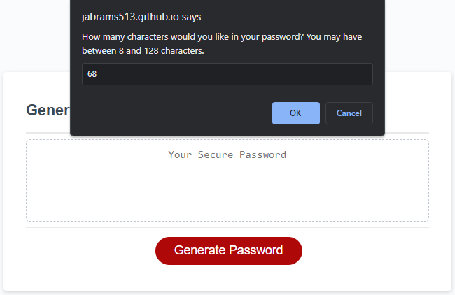
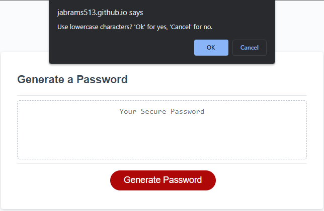
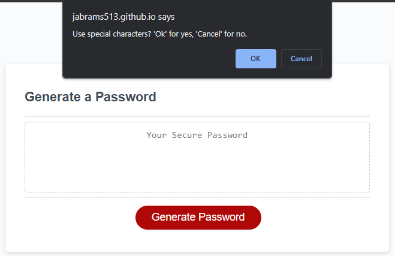
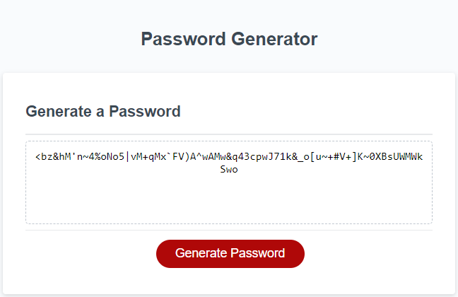

# Random Password Generator
This site exists to provide a randomly generated password after a user answers questions regarding password length and types of characters desired in the password.

## Purpose
When dealing with sensitive data, security is of utmost importance. When logging in to an application hosting sensitive date it is therefore important to be able to generate a strong password meeting many criteria.

## Deployed Webpage Link
https://jabrams513.github.io/random-password-generator/

## User Story

AS AN employee with access to sensitive data

I WANT to randomly generate a password that meets certain criteria

SO THAT I can create a strong password that provides greater security

## Acceptance Criteria

GIVEN I need a new, secure password

WHEN I click the button to generate a password

THEN I am presented with a series of prompts for password criteria

WHEN prompted for password criteria

THEN I select which criteria to include in the password

WHEN prompted for the length of the password

THEN I choose a length of at least 8 characters and no more than 128 characters

WHEN asked for character types to include in the password

THEN I confirm whether or not to include lowercase, uppercase, numeric, and/or special characters

WHEN I answer each prompt

THEN my input should be validated and at least one character type should be selected

WHEN all prompts are answered

THEN a password is generated that matches the selected criteria

WHEN the password is generated

THEN the password is either displayed in an alert or written to the page

## Screenshot
Please refer to the following screenshot as a reference for the web application's appearance and functionality:

## Code Sources and Collaborators
I had the opportunity to collaborate with my peer Mustapha. We checked our work with one another.

In addition, I received feedback from my instructor, Diego, my TA, Andrew, as well as my tutor, Corey.

All code used was self-generated or otherwise gathered from class materials.